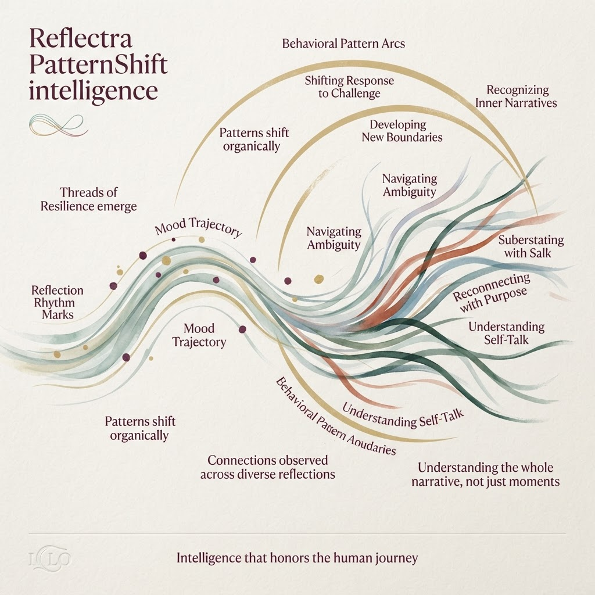
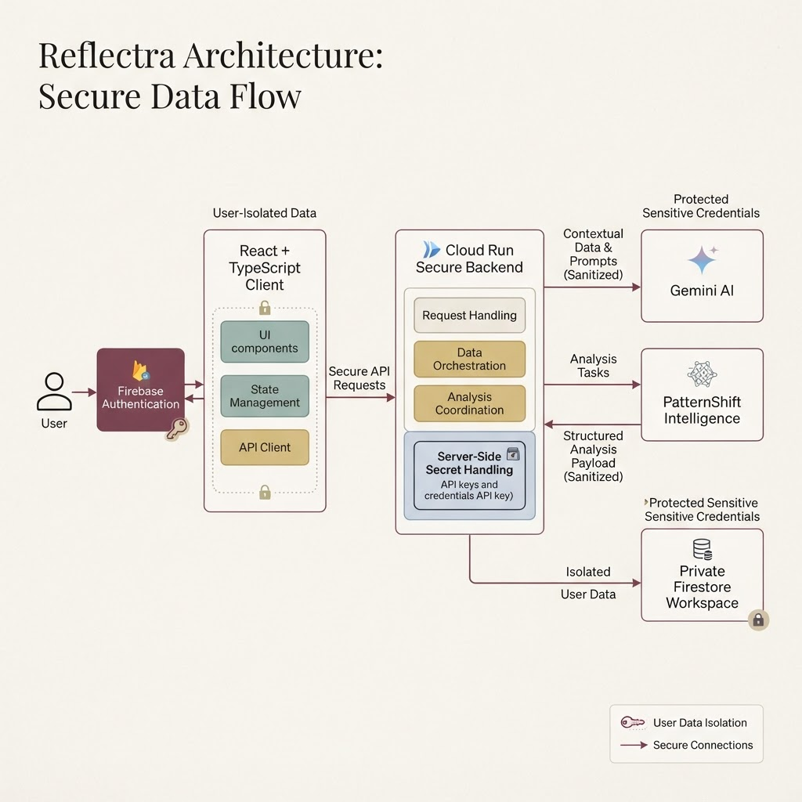
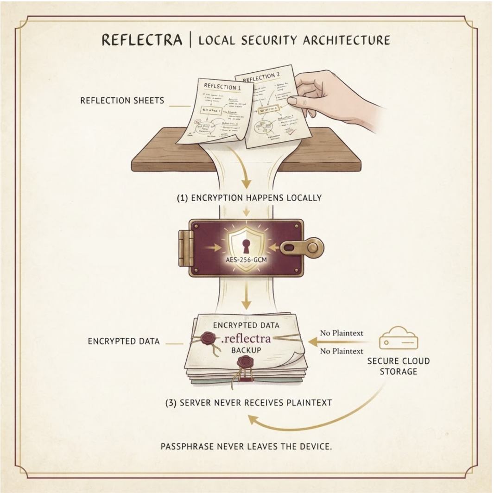

<div align="center">

# ✦ Reflectra

### *Intelligence that honors the human journey.*

A privacy-first reflective intelligence platform that helps people understand the patterns emerging across their journal entries, guided conversations, and emotional rhythms.

<br/>

[](https://react.dev)
[](https://firebase.google.com)
[](https://cloud.google.com/run)
[](https://ai.google.dev)
[](https://www.typescriptlang.org)

**Reflect. Connect. Understand.**

</div>

---

## The idea

Most journaling applications preserve moments.

**Reflectra connects them.**

It is designed around a simple belief: meaningful self-understanding should emerge from *your own history*, not from opaque scores or black-box labels. Reflectra combines guided reflection, longitudinal pattern analysis, deterministic intelligence primitives, and privacy-conscious architecture to help users notice how their emotional landscape evolves over time.

> *A reflection is a moment. A pattern is a story.*

---

# ✦ Mood Constellation

### *Every reflection leaves a point in your story.*

Mood Constellation transforms a reflection history into a living emotional atlas.

Rather than reducing a person to a chart, it maps individual reflections across two intuitive dimensions:

- **Earlier → Recent** — when moments occurred
- **Heavy → Radiant** — how they felt

Shared themes create subtle connections, allowing clusters and recurring threads to emerge naturally.

<p align="center">
  
</p>

### Why it matters

A timeline tells you **what happened**.

A constellation helps you notice **what connects**.

Mood Constellation is intentionally deterministic and privacy-conscious:

- No embeddings
- No vector database
- No hidden similarity scores
- No force-directed randomness
- No raw journal text rendered into visualization metadata

Connections are derived from explainable signals such as **shared normalized tags and temporal proximity**.

<p align="center">
  
</p>

---

# ✦ PatternShift Intelligence

### *Understanding the whole narrative, not just moments.*

PatternShift analyzes longitudinal reflection data to surface meaningful changes across time.

It combines deterministic analysis with Gemini-powered narrative observations, helping users explore questions such as:

- How has my mood trajectory changed?
- Which themes are becoming more prominent?
- When do I tend to reflect?
- Are there unusual changes in my rhythm?
- What patterns persist across different periods?

<p align="center">
  
</p>

## Intelligence with evidence

Reflectra does not treat AI output as unquestionable truth.

Its analysis layer is built around deterministic metrics and evidence structures that can communicate:

- sample size
- confidence
- time range
- aggregate breakdowns
- the reasoning behind an observed pattern

Gemini is used to help articulate observations from sanitized analytical context — **not as a replacement for the underlying evidence layer**.


<p align="center">
  
</p>

---

# ✦ A Secure, User-Isolated Architecture

Reflectra separates client experience, protected backend orchestration, AI analysis, and private user storage.

<p align="center">
  
</p>

### Data flow

```text
User
  │
  ▼
Firebase Authentication
  │
  ▼
React + TypeScript Client
  │  authenticated + owner-scoped requests
  ▼
Cloud Run Secure Backend
  ├──────────────► Gemini AI
  │                  sanitized analytical context
  │
  └──────────────► PatternShift Intelligence
                     deterministic analysis
  │
  ▼
Private Firestore Workspace
```

Every user workspace is isolated through authenticated, owner-scoped access patterns.

---

# ✦ Zero-Knowledge Encrypted Export

### *Your reflections. Your passphrase. Your device.*

Reflectra includes a client-side encrypted export system designed around a zero-knowledge principle.

<p align="center">
  
</p>

### Encryption happens locally

```text
Reflection Data
      │
      ▼
Local Serialization
      │
      ▼
PBKDF2-SHA-256
600,000 iterations
Fresh 16-byte salt
      │
      ▼
AES-256-GCM
Fresh 12-byte IV
      │
      ▼
Encrypted .reflectra backup
```

### What never leaves the device

- Encryption passphrase
- Derived cryptographic key
- Plaintext export payload
- Raw journal/reflection content during encryption

The backend receives **no new plaintext export data** because encryption happens entirely inside the authenticated client.

> **The passphrase never leaves the device.**

<p align="center">
  
</p>

---

# ✦ Guided Reflection

Reflectra is not only a place to write.

It is a space to think.

Guided multi-turn conversations provide a structured reflection experience while preserving a clear boundary between:

- the user's private raw content
- deterministic analytical signals
- sanitized context used for AI-assisted observations

Conversations and journal entries become part of a broader longitudinal workspace, allowing insights to develop across time instead of existing as isolated interactions.

<p align="center">
  
</p>

---

# ✦ External Notifications

Reflection does not always happen on schedule.

Reflectra supports notification integrations designed to reconnect users with their reflective practice without turning the experience into an attention trap.

### Available channels

- ✉️ Email notifications
- 💬 Discord webhook integration
- 🧠 Context-aware smart nudges

The notification architecture maintains strict identity separation:

- authenticated email identity is verified independently
- authorization allowlists are not reused for notification routing
- background jobs fall back safely to owner profile data
- persistence operations handle constrained backend environments gracefully

<p align="center">
  
</p>


---

# ✦ Demo Mode

Reflectra includes a dedicated demo workspace for safe product demonstrations.

Demo mode:

- uses deterministic local fixtures
- mirrors production service interfaces
- avoids production Firestore writes
- avoids backend API calls
- produces reproducible visualizations
- allows judges to explore core flows safely

The Mood Constellation is especially suited for demos: the same fixture dataset produces the same constellation on every reload.

---

# ✦ Technology

| Layer | Technology |
|---|---|
| **Frontend** | React 19 + TypeScript + Vite |
| **Styling** | Tailwind CSS v4 + custom design system |
| **Authentication** | Firebase Authentication |
| **Database** | Cloud Firestore |
| **Backend** | Express on Google Cloud Run |
| **AI** | Google Gemini API |
| **Secrets** | Google Cloud Secret Manager |
| **Visualization** | Deterministic SVG |
| **Testing** | Vitest |
| **Encryption** | Web Crypto API · PBKDF2 · AES-256-GCM |

---

# ✦ Design Principles

Reflectra is guided by a few architectural principles:

### 01 — Privacy before convenience
Sensitive reflection content should not travel farther than necessary.

### 02 — Deterministic before speculative
If an insight can be calculated transparently, it should not require opaque inference.

### 03 — Evidence before assertion
Patterns should have understandable analytical grounding.

### 04 — AI as interpretation, not authority
Gemini helps articulate patterns; deterministic analysis provides the structure beneath them.

### 05 — The user's history belongs to the user
Private workspaces, owner-scoped access, and encrypted exports reinforce this principle throughout the system.

---

# ✦ Project Structure

```text
reflectra/
│
├── src/
│   ├── components/             # Application UI
│   ├── intelligence/
│   │   ├── patternAnalysis/    # Deterministic PatternShift primitives
│   │   └── moodConstellation/  # Constellation transformation + layout
│   ├── services/               # Client data access
│   ├── demo/                   # Isolated demo workspace
│   └── utils/
│
├── server/
│   ├── services/
│   │   ├── geminiService.ts
│   │   ├── notificationIntegrationService.ts
│   │   └── privilegedPersistence.ts
│   └── routes/
│
├── tests/
│
└── firestore.rules
```

---

# ✦ Running Locally

## 1. Clone

```bash
git clone <your-repository-url>
cd reflectra
```

## 2. Install dependencies

```bash
npm install
```

## 3. Configure environment variables

Create your local environment configuration with the required Firebase and backend values.

```bash
cp .env.example .env
```

> Never commit credentials or production secrets.

## 4. Start development

```bash
npm run dev
```

For backend development, use the project's configured server command.

---

# ✦ Security Notes

Reflectra's architecture intentionally separates several security concerns:

- Firebase Authentication verifies identity
- Firestore rules enforce user ownership boundaries
- Cloud Run handles privileged server-side orchestration
- Secret Manager protects backend credentials
- Gemini receives sanitized analytical context rather than unrestricted database access
- Zero-knowledge exports are encrypted locally using the Web Crypto API
- Sensitive backend configuration is never exposed to the client

---

<div align="center">

## Built for reflection that compounds over time.

**Not another journal.  
A way to see the story between the entries.**

<br/>

`Reflect → Connect → Understand`

<br/>

✦ **Reflectra**

</div>
